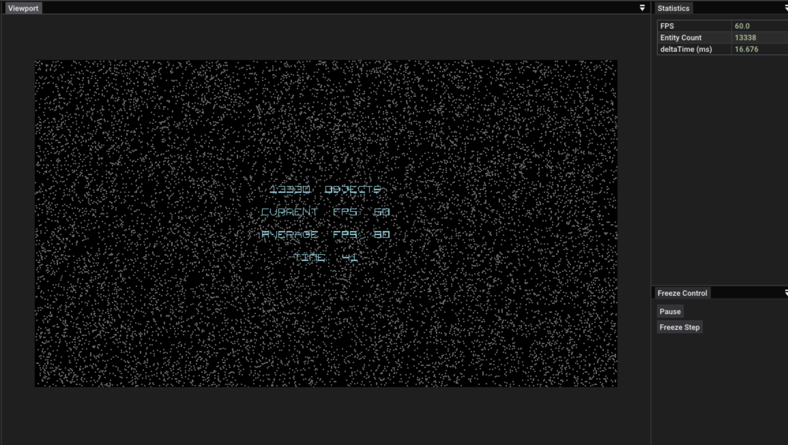

# Parallelization Schemes for Collision Detection
**Team**: Kewei Han (keweihan), Jiya Zhang (jiyaz)

**URL**: https://keweihan.github.io/keweihan-15618-parallel-final-collision/


# Milestone Report (12/3/24)
In order to parallelize our workload, we decided to modify our schedule. Instead of working on fixed-grid cells and then on quadtree, we decided to split work both are worked on at the same time. As a result we have an updated schedule found at the bottom of the report and our progress thus far may differ from the original schedule. 


## Summary
Our main accomplishments so far are 
1. Port an existing sequential collision simulator project to CMake
2. Begin developing quadtree code
3. Identify future tasks and determine feasibility 

In porting, we ported an existing Visual Studio project to instead use CMake so it can be ran and compiled on the GHC clusters with stub CUDA code. This is needed in order for both of us to be able to develop, debug and conduct tests with a collision program. It also involved modifying the project so it can generate metrics in a headless manner (i.e. no display, only shell output). This turned out to be a non-trivial process but we managed to arrive at a point where we have a starter repository with a sequential collison program that can be compiled with CUDA code, ran and debugged on GHC. 

We also have begun looking into and developed skeleton code for a quadtree implementation for our collision detection system. Building upon the existing codebase, we have designed the scope and interface of a new Quadtree class along with a QuadtreeNode class to effectively partition the 2D space and handle imbalanced distributions of colliders. The following three key major components are still under implementation:

1. QuadtreeNode: This class will represent each node in the quadtree to insert colliders, subdivide nodes, and retrieve potential collision candidates. Each node maintains a list of colliders and has pointers to its child nodes.
2. Quadtree: This class will manage the root node of the quadtree and provides high-level methods to insert colliders, clear the tree, and retrieve potential collisions for a given collider.
3. Integration with ColliderSystem: We are in progress modifying the ColliderSystem class to use the quadtree for spatial partitioning. Colliders are inserted into the quadtree each frame, and potential collisions are retrieved efficiently by querying the quadtree. We will be providing a balanced workload of colliders for downstream CUDA implementation.


## Project future
Although our schedule has shifted we believe we are still on track to meet our basic targeted goals. In understanding our starting code we determined that we only need a single CUDA implementation given that we standardize the output of the quadtree and static grid so they can be fed into the same device logic. We think this is feasible and doable within the coming two weeks especially if we efficiently split the work. 


## Poster Session
The project is also setup such that it can run locally on one of our personal laptops with an NVIDIA GPU. This means we can do a visual demonstration of our project during the poster session. Below is a screenshot of the ported program and would be part of our demonstration.



The project is also set up in a way to easily create new scenes with different workload distributions. We can have multiple instances running with different scenes and implementations to visually show the results in addition to data. 

## Updated Goals
1. Consistent interface to cuda device code
2. Cuda device code to parallelize collision resolution 
3. Quadtree implementation
4. Quadtree interface with cuda device code (parallelized collision resolution)
5. Static grid interface with cuda device code (parallelized collision resolution)

Our nice to haves remain as follows, although it is less likely they would be accomplished unless we decide to explore OpenMP. 
1. Parallelize grid construction (quadtree, collision)


## Updated Schedule
**November 17th - 23th** 

Finalize research on spatial grid and quadtree structures. Begin with CUDA-based parallelization of the fixed-grid based a sequential baseline version, using a per-grid approach for balanced workload scenarios.

**November 24th - 30th** 

Establish skeleton code and structure for quadtrees and setup project to be compilable and runnable on GHC for development. Setup CUDA 

**December 1th  -  7th**

Implement a sequential quadtree to handle imbalanced particle distributions. 
Develop interface to cuda device code
Static grid interface with cuda device code 


**December 8th  - 15th**

Quadtree interace with cuda device code
Prepare demo visualizations, speedup graphs, and project documentation.


# Project Proposal (11/23/24)
## Summary
We are going to explore parallelizing collision detection schemes using CUDA.

## Background
Our project focuses on parallelizing a compute-intensive 2D collision detection application involving simulation of 15,000+ moving particles and their collisions. 

In the most basic implementation of this scheme, in every frame the boundaries of each particle can be checked against every other particle in the entire scene to determine which particles collide.

As an optimization of this process, a fixed-grid spatial structure can be constructed every frame such that a 2D scene is divided evenly into coarse grid cells. Each grid cell represents an area in the 2D scene and is a container to references to particles in that area. After such a structure is constructed, the amount of collision checks needed can be drastically reduced to the amount of collision checks needed by only checking collisions between particles in a given cell. 

<p align="center">
  
</p>
<p align="center"><em>Figure 1: visualization of fixed spatial grid structure</em></p>

Below gives pseudocode for a sequential version of the entire resolution process, showing the grid construction step as well as the collision resolution step.

```C++
// Construct grid 
void ColliderGrid::updateGrid() {
   for (int i = 0; i < entities.size(); ++i) {
       // Determine grid cells entity overlaps with
       // Insert entity into respective cell
   }
}

void resolveCollisions(ColliderGrid& colliderGrid) {
 // update grid with collider/entity references
 colliderGrid.updateGrid();
 
 // Iterate through every cell and resolve collisions
 for (int i = 0; i < colliderGrid.size(); ++i)
 {
    // Only brute force check colliders contained within each cell
    for (auto& colliderA : colliderGrid.getCellContents(i))
    {
       for (auto& colliderB : colliderGrid.getCellContents(i))
       {
          // Resolve collision and entity velocities
       }
    }
   }
}

int main() {
    Entity[] entities;
    ColliderGrid colliderGrid(entities);
  
    // Main simulation loop
    while(true)
    {
        // resolve collisions for this frame
        resolveCollisions(colliderGrid);
    }
}
```
Since this method splits a single space into multiple spaces that are, with exceptions, largely independent of each other, there is opportunity for significant parallelization with this spatial grid. 

Our project proposes exploring parallelizing over the **resoloution** step where checks are conducted within each cell in order to improve the performance of this application. From a high level, we assume that we are provided with some preconstructed grid structure, and to parallelize detection each thread can be assigned a cell in which to conduct checks and update velocities if a collision occurs. 

## Challenge
Successful parallelization of the collision detection step for good speedup can be challenging for a number of reasons. We anticipate the following key issues:
- Workload Imbalance: Unequal particle distribution across grid cells will result in some threads having more work than others. 
- Memory Access Patterns: Parallel updates to the entity velocities introduces risks of data races and conflicts when particles span multiple grid cells or quadrants. For instance, a particle can be colliding with two other particles each in different cells resulting in conflicting accesses to the original particle velocity.

One preliminary solution to the issue of workload imbalance is replacing a fixed grid with a quadtree - a spatial structure that maintains variable size grid cells such that each cell contains at most a fixed number of particles. This way we can parallelize over cells that have similar number of internal entities for a more balanced workload. This will also be a key exploration topic of our project.

<p align="center">
  
</p>

However, this solution presents it's own challenges.
- Algorithmic Complexity with Quadtrees: While quadtree integration could reduce collision detection costs with unbalanced particle distribution, a quadtree must be implemented such that parallelization over execution of its elements are possible and efficient. 

By exploring parallelization of collision resolution with different spatial structures we hope to gain better understanding for how to implement more generalized solutions that perform well for different workload scenarios.

## Resources
Some basic resources we are considering are
- Hardware: GHC Machines (GPUs and multicore CPUs); personal Windows operating system.
- Starter Code: https://github.com/keweihan/SimpleECS/tree/main (A basic sequential 2D particle simulator implemented in C++).
- Quadtree-related Resources:
  - https://edwardsjohnmartin.github.io/publications/papers/morrical2017parallel.pdf
  - https://github.com/pvigier/Quadtree

## Goals and Deliverables
### Plan to Achieve

#### **Spatial grid detection parallelization**
- Implement parallelization of the collision resolution step over the existing fixed spatial grid using CUDA.
- Conflict-free access to the grid when itreating over cells

#### **Quadtree construction parallelization for uneven work distribution**
- Implement a sequential quadtree structure, which will provide a hierarchical spatial partitioning that adapts to particle density. This quadtree should be implemented such that efficient parallel data access of elements in a cell is possible. 
- Parallelize the quadtree construction phase with CUDA after testing the sequential implementation to ensure that each CUDA thread can efficiently handle subsets of the quadtree with minimal conflicts.

#### **Performance comparisons**
- Gather performance metrics on balanced and imbalanced workload collision schemes. Vary particle density in different regions of the 2D space and assess the quadtree parallelization scheme's speedup over a fixed structure. 

### Hope to Achieve
#### **Parallelization of spatial grid structure construction**
- Explore CUDA-based parallelization of fixed-grid and/or quadtree construction process prior to the resolution phase. 
- Address challenges in cases where particles span multiple cells or quadrants, potentially using boundary conditions or inter-thread communication to resolve such conflicts efficiently.

### Demo
We aim to show performance metrics, including speedup graphs and memory usage visualizations for CUDA implementation under different distribution simulation. 
The existing codebase also has a visualization of the collision scenes with FPS counters that we will aim to demonstrate during the poster session.

The ideal success is significant speedup in the form of lower frame times (or higher FPS) for both fixed-grid and quadtree implementations in scenes with evenly distributed particles, as well as signficant speedup in the quadtree implementation over the fixed-grid implementation for unevenly distributed scenes. 

In summary, the problem context is that we begin with a 2D scene with many particles that is capable of movement and collision. The end goal is to identify a collision detection and paralleization strategy to efficiently handle a variety of scenarios including situations where there is significant imbalance in particle distribution across the scene. Our current primary end candidate for this solution is using a quadtree structure and parallelizing over its grid cells. 

# Platform Choice
For implementation, we will use CUDA, as it's beneficial to handle the high degree of parallelism in collision detection, particularly with proper memory access handling and kernel management. 
We will mainly use GHC to conduct performance tests.

# Schedule
**November 17th - 23th** 
Finalize research on spatial grid and quadtree structures. Begin with CUDA-based parallelization of the fixed-grid based a sequential baseline version, using a per-grid approach for balanced workload scenarios.

**November 24th - 30th** 

Implement and test parallelization over fixed-grid cells with CUDA. Gather initial speedup data over sequential implementation. 

**December 1th  -  7th**

Implement a sequential quadtree to handle imbalanced particle distributions. Gather initial speedup data over sequential fixed-grid implementation. Begin implementation of parallelized execution over quadtree cells. 

**December 8th  - 15th**

Complete quadtree parallel execution implementation and finalize performance testing for both grid-based and quadtree implementations, focusing on speedup and memory usage metrics. Prepare demo visualizations, speedup graphs, and project documentation.


# Other Notes
Currently this construction process is done sequentially for each cell. We plan to parallelize the fixed-grid construction process involving particle-to-cell assignment (updateGrid) by exploring per-grid or per-particle parallelization strategies.


Another aspect our project will involve is implementing a quadtree structure in place of a fixed spatial grid and parallelizing its construction. Quadtrees are a way for maintaining a spatial strucutre such that each grid cell does not contain more than a set amount of entities, and if it will the tree will recursively split into more nodes to satisfy that constraint. 

This gives performance benefits when simulating a scene with uneven entity distribution, using a quadtree structure in the collision scheme approach can improve performance for scenes with unevenly populated populated grid areas. The quadtree structure allows for hierarchical partitioning, reducing the number of collision checks necessary by only examining particles within relevant quadrants.
